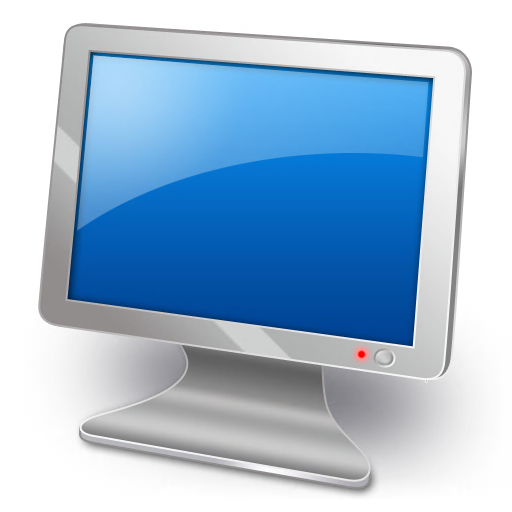

# *Dashboard*
---

---

Dashboard is a fast and easy monitoring application for [NetLogger](https://www.netlogger.org) amateur radio nets.

This application is built using Embarcadero's [C++ Builder Community Edition](https://www.embarcadero.com/products/cbuilder/starter/),
which is free to use for non-commercial purposes. I chose this toolset as I am a longtime user of C++ Builder and I appreciate the simplicity
of the C++ Builder/Delphi runtime library ecosystem for building native desktop apps.
Besides, I've been around since the [Turbo C 1.5](https://en.wikipedia.org/wiki/Borland_Turbo_C) days.

This is a straightforward IDE project in c++ using the Delphi VCL component library. There's no makefiles to deal with. It's themed as well with plenty of light and dark UI styles to choose from. It has a FireDAC SQLite backend which isn't really being needed/exploited at the moment, but will make it super easy to add advanced features in the future, such bulk storage and querying and so on, but the primary goal here is to be exceedingly *simple*, self explanatory and *easy on the eyes* - less distraction, more ***radio***! 

There is also future potential for making a FireMonkey-based version for Android and an Mac as well if there is any interest.

Installs are built using the free-to-use version of [Advanced Installer](https://www.advancedinstaller.com/).

New program updates can be queried for within the program and can be downloaded and installed if desired.

I created a munged-up modification of the simple [WinGup](https://wingup.org/) system used by [Notepad++](https://notepad-plus-plus.org/) (an awesome program editor!) to handle program update duties. Rather than an as external program, I just built the functionality into the Dashboard application itself. The application can download the latest installer version
(a Windows .MSI file) and then call ShellExcute to run the install while then closing itself (the running application) so the the install/update can complete successfully.

Overall, Dashboard is a fine example of what you can do as a hobby project, where you're just kickin' back and enjoying yourself.

[WG5ENE](https://qrz.com/db/wg5ene)

